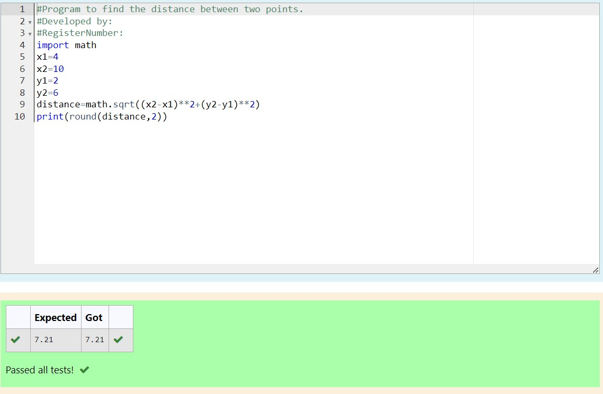

# DISTANCE-BETWEEN-TWO-POINTS

## AIM:
To write a python program to find the distance two 2 points
## ALGORITHM:
### Step 1:
Import the math module. 
### Step 2: 
Assign the value of the variable.
### Step 3: 
Substitute the values in the distance formula  
### Step 4:
Print the distance. 
### Step 5: 
End the program.
### PROGRAM:
```python
#Program to find the distance between two points.
#Developed by: 
#RegisterNumber:
import math
x1=4
x2=10
y1=2
y2=6
distance=math.sqrt((x2-x1)**2+(y2-y1)**2)
print(round(distance,2))
```


### OUTPUT:


### RESULT:
Thus the program to find the distance between two point is written and verified using python programming.
